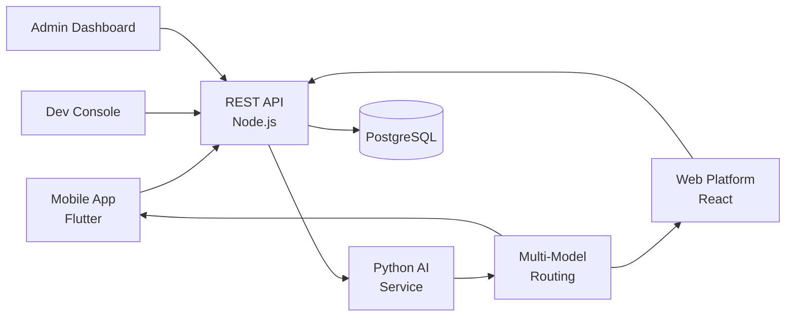

# Grok Clone — White-Label AI Platform & Assistant by Miracuves

**MXAI** is a production-ready, white-label Grok clone: a complete AI platform with chat, generation, retrieval, and admin console — delivered with **100% source code ownership** in **6 working days**.

> 🤖 **See it running before you talk to anyone.** Live user app, admin console, and API playground — demo credentials are printed on the [solution page](https://miracuves.com/grok-clone#demo). No sales call required.

---

## 🚀 Live Demos

| Environment | URL | What you can test |
|---|---|---|
| 📱 Mobile App | [mas.mimeld.com](https://mas.mimeld.com) | Chat, generate, analyze, create |
| 🌐 Web Platform | [mxai.mimeld.com](https://mxai.mimeld.com) | Full AI workspace in browser |
| ⚙️ Dev Console | [Solution page → Demo](https://miracuves.com/grok-clone#demo) | Models, embeddings, fine-tunes, logs |
| 🛠️ Admin Dashboard | [Solution page → Demo](https://miracuves.com/grok-clone#demo) | Users, plans, billing, analytics |

Demo credentials for all environments: **[miracuves.com/grok-clone → Demo section](https://miracuves.com/grok-clone/#demo)**

---

## ✨ What Makes This Grok Clone Different

Most AI scripts stop at "send a prompt." This platform ships with the features that actually run an AI *business*:

- **Multi-Model Routing** — auto-routes each query to the best model (cost, latency, capability) — same pattern Microsoft Copilot uses
- **Built-In Web Search** — 
- **Retrieval-Augmented Generation** — real-time web search integrated — answers grounded in current sources, not just training data
- **Streaming + Function Calling** — fine-tuning pipeline with eval suite, dataset versioning, and rollout controls — same MLOps Anthropic, OpenAI ship
- **Fine-Tuning + Eval** — streaming outputs with first-class function calling and tool use — what production AI looks like

## 📦 Core Features

**User:** chat · image generation · code · analysis · web search · file uploads · voice · multilingual · prompt library

**Developer (API):** REST & streaming APIs · model selection · fine-tuning · embeddings · usage analytics · billing · SDKs

**Admin:** user management · model marketplace · billing & quota · abuse moderation · analytics

## 🏗️ Architecture

**Stack:** React for web · Flutter mobile · Node.js backend · Python AI service · Pinecone/Weaviate for vector store · Stripe for billing · Stripe, regional gateways

## 📋 What’s Included

- ✅ Full source code — backend, web, mobile apps, panels (no encryption, no license locks)
- ✅ Deployment to your servers & app store submission assistance
- ✅ Your branding — white-label rename, logo, colors, domain
- ✅ 60 days post-launch support + 12 months of free updates
- ✅ Documentation & handover

**Pricing:** from **$3,299**, transparent on the [solution page](https://miracuves.com/grok-clone/#pricing) — no "contact us for quote" games.

## 🆚 Why Not Build From Scratch?

Custom AI platforms run $100k–$500k and 4–9 months. A proven white-label base gets you to market in 6 working days for a fraction of that, with your budget preserved for inference costs and integrations.

## 📚 Resources

- 📖 [Grok Clone — Full Solution Page](https://miracuves.com/grok-clone) (features, pricing, demos, FAQ)
- 💰 [How Much Does an AI Platform Cost in 2026?](https://miracuves.com/grok-clone#pricing) pricing breakdown & what's included
- 📝 [Best Grok Clone Script in 2026](https://miracuves.com/grok-clone/blog/) features, pricing & launch guide
- 🧠 [Multi-Model Routing: How AI Products Cut Inference Cost](https://miracuves.com/grok-clone/blog/) routing, budgeting, fallback
- ✅ [Miracuves Facts & Claims Ledger](https://miracuves.com/grok-clone/facts/) every claim we make, verified

## 🏢 About Miracuves

[Miracuves Solutions](https://miracuves.com) builds white-label clone apps and custom software from Mumbai, India — 90+ ready-made solutions, live demos for every product, transparent pricing, and delivery in 6 working days. Operating since 2010.

**Talk to us:** [WhatsApp](https://wa.me/919830009649) · [Schedule a consultation](https://miracuves.com/schedule-consultation/) · [miracuves.com](https://miracuves.com)

---

### ⚠️ Note on This Repository

This repository is a product overview. The full source code is delivered to clients on purchase — see [what’s included](https://miracuves.com/grok-clone/#included). For a hands-on evaluation, use the live demos above; credentials are public on the solution page.

*Keywords: grok clone, grok clone script, AI platform, AI assistant, white label ChatGPT, multi-model, RAG, Flutter AI, Node.js AI*

---

<!--
══════════════════════════════════════════════════
TEMPLATE VARIABLE KEY — auto-generated from Netflix-Clone pattern
══════════════════════════════════════════════════
{APP_NAME}        Grok Clone
{MX_NAME}         MXAI
{CATEGORY}        AI Platform & Assistant
{DEMO_WEB}        mxai.mimeld.com
{PRICE}           $3,299
{SLUG}            grok-clone
{SOLUTION_URL}    https://miracuves.com/grok-clone/
{VERTICAL}        ai_tech

See /tmp/verticals/ai_tech.txt for the vertical config used to generate this README.
══════════════════════════════════════════════════
-->